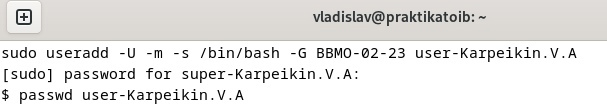

#Отчет по ПР-2 "Идентификация и аутентификация"
---
##Задача
---
В данном задании выполнены следующие шаги:
1. оздана виртуальная машина на базе ОС Debian 12.
2. Создан пользователь super-Karpeikin.V.A и наделен привилегиями суперпользователя.
3. Создана группа group-BBMO-02-23.
4. Добавен пользователь super-Karpeikin.V.A в группу group-BBMO-02-23.
5. Проверено наличие пользователя в группе.
6. Создан пользователь user-Karpeikin.V.A и добавен в группу group-BBMO-02-23.
7. Продемонстрирована работа механизмов разграничения доступа.
---

#Шаги выполнения
---
##Шаг 1
---
Установить виртуальную машину.

---
##Шаг 2
---
Создание суперпользователя super-Karpeikin.V.A sudo useradd super-Karpeikin.V.A
sudo usermod -a -G sudo super-Karpeikin.V.A
passwd super-Karpeikin.V.A

---
##Шаг 3
---
Создание группы group-BBMO-02-23.
sudo groupadd BBMO-02-23
sudo usermod -aG BBMO-02-23 super-Karpeikin.V.A

---
##Шаг 4
---
Создание обычного пользователя user-Karpeikin.V.A и добавление его в созданную ранее группу.
sudo useradd -U -m -s /bin/bash -G BBMO-02-23 user-Karpeikin.V.A
passwd user-Karpeikin.V.A

---
##Шаг 5
---
Проверка наличия пользователя user-Karpeikin.V.A в группу group-BBMO-02-23.
groups user-Karpeikin.V.A
groups super-Karpeikin.V.A

---
##Шаг 6
---
Наделить полномочиями user-Karpeikin.V.A
sudo chmod 770 ~
sudo chown super-Karpeikin.V.A:BBMO-02-23 ~

---
##Шаг 7
---
Проверка механизмов разграничения доступа.
mkdir 1.txt
touch 1.txt
rm 1.txt

